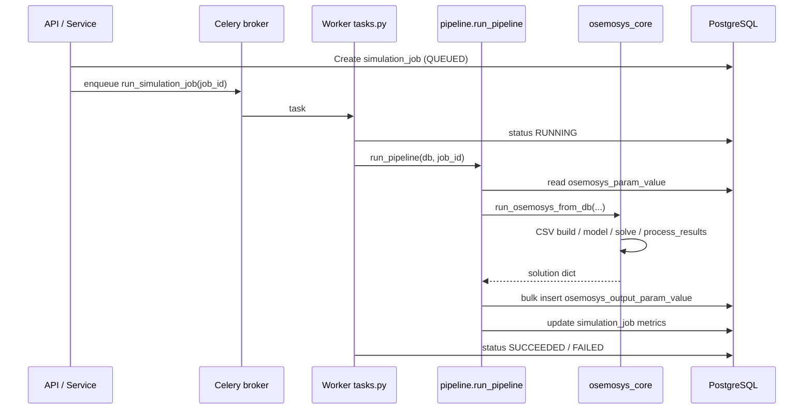

# Simulation Module — OSeMOSYS UPME Backend

This module implements the **computational path** from scenario parameters to **solver results persisted in PostgreSQL**.

---

## Purpose

`app.simulation` orchestrates a full **OSeMOSYS** linear programming run in the application stack:

1. **Ingest** scenario input from the database (`osemosys_param_value` + catalogue tables) or, for offline use, from **Excel** or pre-generated **CSVs**.
2. **Build** a Pyomo `AbstractModel` (full OSeMOSYS formulation) and instantiate it via **DataPortal** and CSV files in a temporary directory.
3. **Solve** with **GLPK** or **HiGHS** (via Pyomo).
4. **Extract** dispatch, capacity, unmet demand, emissions, and derived “intermediate” reporting variables.
5. **Persist** bulk results into `osemosys_output_param_value` and roll-up metrics on `simulation_job` when executed through the transactional **pipeline** + **Celery** worker.

**Role in the system:**

```text
┌─────────────────────────────────────────────────────────────────────────┐
│                        app.simulation                                    │
├─────────────────────────────────────────────────────────────────────────┤
│  PostgreSQL (osemosys_param_value)  ──►  data_processing  ──►  CSV tmp   │
│                                                    │                     │
│                                                    ▼                     │
│                              model_definition.create_abstract_model()    │
│                                                    │                     │
│                                                    ▼                     │
│                              instance_builder.build_instance()          │
│                                                    │                     │
│                                                    ▼                     │
│                              solver.solve_model()                        │
│                                                    │                     │
│                                                    ▼                     │
│                              results_processing.process_results()        │
└────────────────────────────────────────────┬────────────────────────────┘
                                             │
              Celery task / run_pipeline     │
                                             ▼
┌─────────────────────────────────────────────────────────────────────────┐
│  simulation_job (metadata)  +  osemosys_output_param_value (series)    │
└─────────────────────────────────────────────────────────────────────────┘
                                             │
                                             ▼
                               app.visualization (charts, KPIs, exports)
```

---

## Component overview


| File / package               | Responsibility                                                                                                                                                                                                                                                                                                                                                                             |
| ---------------------------- | ------------------------------------------------------------------------------------------------------------------------------------------------------------------------------------------------------------------------------------------------------------------------------------------------------------------------------------------------------------------------------------------ |
| `osemosys_core.py`           | **Public API** for three entry modes: `run_osemosys_from_db`, `run_osemosys_from_csv_dir`, `run_osemosys_from_excel`. Manages temp CSV directory (DB/Excel paths), stage callbacks (`on_stage`), optional LP export, timings merge into results.                                                                                                                                        |
| `pipeline.py`                | **Production orchestration** for one `simulation_job`: logs staged events, summarises input counts, calls `run_osemosys_from_db`, maps solution dict → SQL rows (`_build_output_rows`), **batched** `INSERT` into `OsemosysOutputParamValue`, updates job fields (`objective_value`, `coverage_ratio`, `stage_times_json`, etc.). Cooperative **cancellation** via `SimulationRepository`. |
| `tasks.py`                   | **Celery task** `run_simulation_job`: transitions `QUEUED` → `RUNNING`, invokes `run_pipeline`, sets terminal `SUCCEEDED` / `FAILED` / respects `CANCELLED`, logs events.                                                                                                                                                                                                                  |
| `celery_app.py`              | Celery instance: broker/backend from settings (`redis_url` or in-memory when sync mode), JSON serializers, autodiscovery, solver availability warning at worker startup.                                                                                                                                                                                                                   |
| `runner.py`                  | **Synchronous** `run_simulation_sync(job_id)` for tests/debug—opens `SessionLocal` and runs `run_pipeline`.                                                                                                                                                                                                                                                                                |
| `export_results.py`          | **Filesystem export** of solution dict to CSV/JSON (notebook-style folders): dispatch, new capacity, unmet demand, annual emissions, summary metrics, intermediate variables.                                                                                                                                                                                                              |
| `benchmark.py`               | Small **numerical tolerance helpers** for regression / parity checks (`relative_error`, `compare_with_tolerance`).                                                                                                                                                                                                                                                                         |
| `core/data_processing.py`    | **PostgreSQL → CSV** pipeline: resolved SQL joining param values to catalogue tables, `PARAM_INDEX` metadata, matrix completion, emissions preprocessing, UDC handling. Returns `ProcessingResult` (sets, `has_storage`, `has_udc`, id/name maps). Also `get_processing_result_from_csv_dir` for CSV-only runs.                                                                            |
| `core/model_definition.py`   | `**create_abstract_model(has_storage, has_udc)`** — complete OSeMOSYS LP: sets, parameters, variables, objective, constraints (Apache-licensed structure aligned with reference OSeMOSYS).                                                                                                                                                                                                 |
| `core/instance_builder.py`   | `**build_instance(model, csv_dir, ...)**` — loads sets/parameters from CSV names expected by DataPortal; switches optional storage/UDC CSVs consistently with abstract model.                                                                                                                                                                                                              |
| `core/solver.py`             | `**solve_model**`, optional `**write_lp_file**` with symbolic labels, `**get_solver_availability**`, infeasibility **diagnostics** logging (`_run_infeasibility_diagnostics`).                                                                                                                                                                                                             |
| `core/results_processing.py` | `**process_results`** — extracts `dispatch` from `RateOfActivity` × `YearSplit`, `new_capacity`, `unmet_demand`, `annual_emissions`, builds `sol` structure, `**_compute_intermediate_variables**` (e.g. `TotalCapacityAnnual`, `ProductionByTechnology`, `UseByTechnology`, cost/emission/storage artefacts).                                                                             |
| `core/excel_to_csv.py`       | `**generate_csvs_from_excel**` — delegates to `backend/scripts/compare_notebook_vs_app.py` for SAND-style Excel → CSV generation.                                                                                                                                                                                                                                                          |


---

## Data flow

### Inputs


| Source                           | Description                                                                                             |
| -------------------------------- | ------------------------------------------------------------------------------------------------------- |
| `osemosys_param_value` (+ joins) | Primary app path; keyed by `id_scenario`.                                                               |
| temp CSV directory               | Produced by `run_data_processing` or supplied externally (`run_osemosys_from_csv_dir`).                 |
| Excel `.xlsx` / `.xlsm`          | SAND-style **Parameters** sheet; path via `run_osemosys_from_excel` / `run_data_processing_from_excel`. |
| `simulation_job`                 | Holds `scenario_id`, `solver_name`, status flags (`cancel_requested`), used by `pipeline` and `tasks`.  |


### Outputs (solution dict)

Key fields returned by `process_results` / `run_osemosys_from_`*:


| Field                                                             | Meaning                                                                                                                        |
| ----------------------------------------------------------------- | ------------------------------------------------------------------------------------------------------------------------------ |
| `objective_value`, `solver_name`, `solver_status`                 | Optimisation outcome.                                                                                                          |
| `coverage_ratio`, `total_demand`, `total_dispatch`, `total_unmet` | Demand balance KPIs.                                                                                                           |
| `dispatch`, `new_capacity`, `unmet_demand`, `annual_emissions`    | Tabular series for DB persistence and charts.                                                                                  |
| `sol`                                                             | Normalised “index + value” lists for key variables.                                                                            |
| `intermediate_variables`                                          | Dict of variable name → `[{ "index": [...], "value": float }, ...]` (e.g. capacity stacks, use/production by technology/fuel). |
| `model_timings`                                                   | Stage timing dict (merged in `osemosys_core`).                                                                                 |


### Persistence mapping (`pipeline._build_output_rows`)

```text
solution["dispatch"]           → variable_name = Dispatch      (typed columns + value2 = cost)
solution["new_capacity"]       → NewCapacity
solution["unmet_demand"]       → UnmetDemand
solution["annual_emissions"]   → AnnualEmissions
solution["intermediate_variables"][X] → variable_name = X, index_json = entry["index"]
```

### End-to-end sequence (Celery)




---

## Usage guide

### Running a job via worker (normal operations)

Jobs are enqueued from the application service layer; the worker executes `app.simulation.tasks.run_simulation_job`. Configure Redis (or memory broker for local sync mode—see `get_settings().is_sync_simulation_mode()`).

### Synchronous debugging

```python
from app.simulation.runner import run_simulation_sync

# Blocks until pipeline completes; use only in controlled environments
run_simulation_sync(job_id=123)
```

### Programmatic solve without DB persistence

```python
from app.simulation.osemosys_core import run_osemosys_from_csv_dir

result = run_osemosys_from_csv_dir(
    "/path/to/csv_folder",
    solver_name="highs",  # or "glpk"
)
print(result["solver_status"], result["objective_value"])
```

### Excel/notebook parity path

```python
from pathlib import Path
from app.simulation.osemosys_core import run_osemosys_from_excel

result = run_osemosys_from_excel(
    Path("scenario.xlsm"),
    solver_name="glpk",
    sheet_name="Parameters",
)
```

### Export results to disk

```python
from app.simulation.export_results import export_solution_to_folder

export_solution_to_folder(result, "output/resultados", write_json=True)
```

### Extending intermediate reporting

Add or adjust logic in `_compute_intermediate_variables` in `core/results_processing.py`. Any new top-level series intended for DB storage must also be wired in `pipeline._build_output_rows` if persisted.

---

## Design decisions and limitations

1. **CSV shim for DataPortal** — Even when the source of truth is PostgreSQL, the engine builds **temporary CSVs** to feed Pyomo’s DataPortal, matching the proven notebook workflow and easing parity checks.
2. **Notebook alignment** — Comments reference TB-04 / notebook cells; `instance_builder` loads parameters (e.g. `DepreciationMethod`, `CapacityOfOneTechnologyUnit`, investment limits) to avoid **LP drift** versus the reference notebook.
3. **Two feature flags on the model** — `has_storage` and `has_udc` must stay **consistent** across `create_abstract_model` and `build_instance` / processing steps.
4. **Solver portability** — `solver.py` maps aliases `glpk` → `glpk`, `highs` → `appsi_highs`. Worker images must ship the chosen executable; `get_solver_availability` logs gaps at startup.
5. **Batch inserts** — `BATCH_SIZE = 2000` limits single-statement size; extremely large models still produce many rows—DB indexing on `(id_simulation_job, variable_name)` is critical for downstream visualization.
6. **Cancellation** — Cooperative: pipeline checks `cancel_requested` between stages; abrupt kills may still leave partial states until reconciled.
7. **Excel path dependency** — `excel_to_csv.py` relies on `backend/scripts/compare_notebook_vs_app.py`; missing script raises a clear `FileNotFoundError`.
8. **No long-term artefact storage in LP path** — Temporary directories are cleaned up; for audit trails, persist exported CSVs/JSON or enable LP generation with explicit `lp_dir`.

---

## Related modules

- **Visualization:** `app.visualization` consumes `osemosys_output_param_value`.
- **Repositories:** `app.repositories.simulation_repository` for job lifecycle and events.
- **Configuration:** `app.core.config` for `redis_url` and simulation mode flags.

