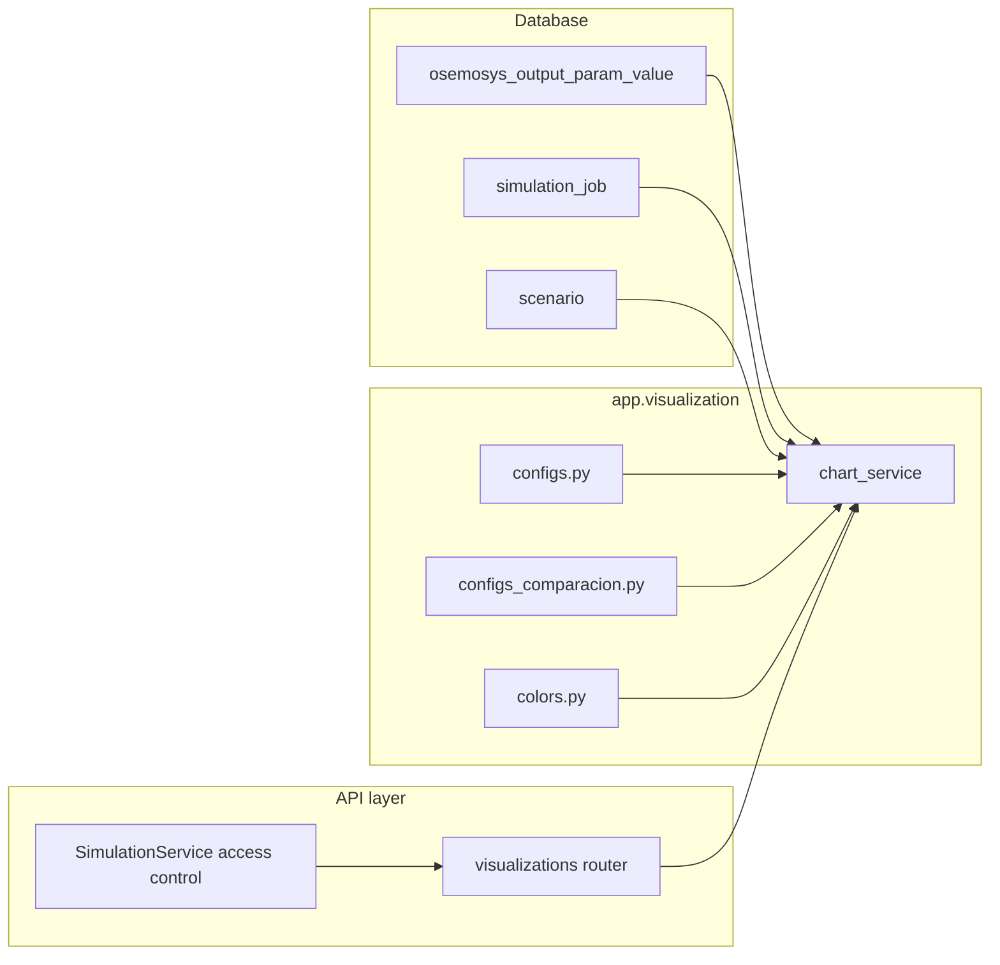

# Visualization Module — OSeMOSYS UPME Backend

This document explains how scenario results become API-ready chart payloads and exports—without duplicating the optimisation core.

---

## Purpose

The `app.visualization` package turns **persisted OSeMOSYS outputs** (PostgreSQL) into **structured JSON** for the web UI and into **downloadable assets** (ZIP of plots, Excel of raw rows). It replaces legacy standalone plotting scripts (`graficas.py` / `graficas_comparacion.py` from `osemosys_src`) by:

- Reading directly from `osemosys_output_param_value` keyed by `simulation_job`.
- Returning **Pydantic schemas** (`app.schemas.visualization`) suitable for FastAPI.
- Centralising **chart definitions** in declarative config dictionaries (`CONFIGS`, `CONFIGS_COMPARACION`) plus **colour rules** (`colors.py`).

**Role in the system:**

```text
┌─────────────────┐     bulk insert      ┌──────────────────────────┐
│  simulation     │ ──────────────────►  │ osemosys_output_param_   │
│  pipeline       │                      │ value (+ SimulationJob)   │
└─────────────────┘                      └────────────┬─────────────┘
                                                        │
                              SQLAlchemy Session        │
                                                        ▼
                                             ┌──────────────────────┐
                                             │  app.visualization   │
                                             │  (chart_service)     │
                                             └──────────┬───────────┘
                                                        │
                        ┌──────────────────────────────┼──────────────────────────────┐
                        ▼                              ▼                              ▼
                 ChartDataResponse            CompareChartResponse              exports (ZIP/XLSX)
                 (single scenario)            (multi-job / facets)
```

---

## Component overview

| File / symbol | Responsibility |
|---------------|----------------|
| `__init__.py` | Public re-exports: colour helpers, `CONFIGS`, `CONFIGS_COMPARACION`, and chart service entrypoints (`build_chart_data`, `build_comparison_data`, `get_result_summary`, `get_chart_catalog`). |
| `colors.py` | **Palette logic** without NumPy/Matplotlib: fuel/sector colour maps (`COLORES_GRUPOS`), `asignar_grupo`, `generar_colores_tecnologias`, `_color_por_grupo_fijo`, and **power-sector families** (`FAMILIAS_TEC`, `COLOR_MAP_PWR`, `_color_electricidad`). |
| `configs.py` | **Single-scenario chart registry** `CONFIGS`: each entry defines `variable_default` (e.g. `UseByTechnology`), optional `filtro` callable, `agrupar_por`, `color_fn`, flags (`es_capacidad`, `es_porcentaje`), and titles. Named filter functions encode UPME technology-prefix conventions (e.g. `DEMRES`, `PWR`, `NGS`). |
| `configs_comparacion.py` | **Multi-scenario comparison** registry `CONFIGS_COMPARACION`: `prefijo` / tuple of prefixes, `agrupacion_default` or `agrupacion_fija`, `año_historico_unico`, and `variable_default`. Also `MAPA_SECTOR` / `COLORES_SECTOR` for six-character technology prefix → sector label. |
| `chart_service.py` | **Core service:** loads rows from DB, normalises to `TECHNOLOGY` / `FUEL` / `YEAR` / `VALUE`, applies filters and aggregations, builds `ChartDataResponse` / `CompareChartResponse` / `CompareChartFacetResponse`, KPI summary, catalog metadata, and **export** helpers (`export_all_charts_zip`, `export_raw_data_excel`). |

### Main functions (`chart_service.py`)

- **`_load_variable_data(db, job_id, variable_name)`** — Loads `OsemosysOutputParamValue` rows. Uses typed columns for primary variables (`Dispatch`, `NewCapacity`, `UnmetDemand`, `AnnualEmissions`); for others, parses `index_json` with heuristic positions for REGION/TECHNOLOGY/FUEL/YEAR.
- **`build_chart_data(...)`** — Single job + `tipo` key in `CONFIGS`; optional `un` (PJ, GW, MW, TWh, Gpc), `sub_filtro`, `loc` (URB/RUR/ZNI for residential), `variable` override for capacity charts, `agrupar_por` override.
- **`build_comparison_data(...)`** — Multiple `job_ids` (max 10 at API layer), `tipo` in `CONFIGS_COMPARACION` or fallback from `CONFIGS` (“generic” path); subplots per **year** with scenarios as categories; optional historic-year handling from first scenario only when configured.
- **`build_comparison_facet_data(...)`** — One **full time series per scenario** (facet), reusing `build_chart_data` per job.
- **`get_result_summary(db, job_id)`** — Header KPIs: solver name/status, objective, coverage, demand/dispatch/unmet totals, summed `AnnualEmissions`, scenario name.
- **`get_chart_catalog()`** — Lists available `tipo` ids for the UI with hints (`es_capacidad`, sub-filters, location support).
- **`export_all_charts_zip` / `export_raw_data_excel`** — Batch rendering (Matplotlib Agg) and raw row dump for downloads.

**Private helpers:** `_filtrar_df`, `_asignar_categoria`, `_convertir_unidades`, `_color_map_comparison`, `_procesar_bloque_comparacion`, `_procesar_bloque_single`, `_render_stacked_bar`, etc.

---

## Data flow

### Inputs

| Source | Content |
|--------|---------|
| PostgreSQL `osemosys_output_param_value` | Filtered by `id_simulation_job` and `variable_name`. |
| PostgreSQL `simulation_job` | Job metadata for summaries and progress-related fields (`model_timings_json`, totals). |
| PostgreSQL `scenario` | Scenario display name for comparison labels. |
| In-memory config | `CONFIGS` / `CONFIGS_COMPARACION` / colour maps |

**Variable names consumed** (non-exhaustive; see `CONFIGS` values):  
`UseByTechnology`, `ProductionByTechnology`, `TotalCapacityAnnual`, `NewCapacity`, `AccumulatedNewCapacity`, `AnnualEmissions`, `AnnualTechnologyEmission`, etc.

### Outputs

| Output | Consumer |
|--------|-----------|
| `ChartDataResponse`, `CompareChartResponse`, `CompareChartFacetResponse`, `ResultSummaryResponse`, `ChartCatalogItem[]` | FastAPI `app.api.v1.visualizations` and frontend charts. |
| ZIP stream (SVG/PNG) | User download (`/{job_id}/export-all`). |
| Excel stream | User download (`/{job_id}/export-raw`). |

### Dependency diagram



**Upstream module:** `app.simulation` (pipeline) populates `osemosys_output_param_value`. Visualisation assumes **consistent indexing** in `index_json` for intermediate variables (see `chart_service._load_variable_data`).

---

## Usage guide

### HTTP API (production path)

Base path is registered under the v1 API with prefix **`/visualizations`** (see `app.api.v1.visualizations`).

Examples:

- Catalogue: `GET /visualizations/chart-catalog`
- Single chart: `GET /visualizations/{job_id}/chart-data?tipo=gas_consumo&un=PJ`
- Comparison: `GET /visualizations/chart-data/compare?job_ids=1,2,3&tipo=res_comparacion&un=PJ&years_to_plot=2024,2030,2050&agrupacion=SECTOR`
- Facets: `GET /visualizations/chart-data/compare-facet?job_ids=1,2&tipo=cap_electricidad&un=GW`
- Summary: `GET /visualizations/{job_id}/result-summary`

All endpoints require authentication and successful job state where applicable (`SUCCEEDED`).

### Programmatic use (internal scripts / notebooks)

```python
from sqlalchemy.orm import Session
from app.visualization.chart_service import build_chart_data, get_result_summary

def example(db: Session, job_id: int):
    chart = build_chart_data(db, job_id, tipo="elec_produccion", un="TWh")
    summary = get_result_summary(db, job_id)
    return chart.model_dump(), summary.model_dump()
```

**Extend with a new single-scenario chart:**

1. Add a filter callable in `configs.py` (or reuse an existing one).
2. Add a new entry to `CONFIGS` with `variable_default`, `filtro`, `agrupar_por`, `color_fn`, and title fields.
3. If the UI needs sub-filter metadata, ensure the filter function name is listed in `_config_has_sub_filtro` / `_config_sub_filtros` in `chart_service.py`.

**Extend comparison charts:** add to `CONFIGS_COMPARACION` with appropriate `prefijo`, `agrupacion_*`, and `año_historico_unico`.

---

## Design decisions and limitations

1. **DB-centric, not file-centric** — Charts no longer depend on CSV folders; this aligns the web app with the same persistence model as the Celery pipeline.
2. **Declarative configs** — Business rules (technology prefixes, sectors) live in `CONFIGS` rather than scattered in the frontend, improving auditability for cooperation projects.
3. **Two storage shapes for output rows** — “Main” variables use typed columns; others use `index_json`. The loader applies **heuristics** for index length (3/4/5 elements); malformed or inconsistent indices can yield empty or partial charts.
4. **Unit conversions** — `_convertir_unidades` applies fixed factors (PJ baseline). Analysts should treat displayed units as **application-defined**, not automatically guaranteed to match every external publication without cross-check.
5. **Comparison caps** — The REST layer limits to **10 jobs** per comparison request to control memory and query cost.
6. **Historical year in comparison** — Some configs take the first plotted year as “historic” from **only the first job** when `año_historico_unico` is true—documented behaviour for aligned reporting.
7. **Exports** — `export_all_charts_zip` uses Matplotlib in headless mode; server deployments must include compatible fonts/backend dependencies.
8. **Colour stability** — Technology-level colouring uses deterministic family/group rules; exact hex values may change if `colors.py` mappings are updated—important for institutional branding discussions with partners.

---

## Related code

- API router: `app/api/v1/visualizations.py`
- Response schemas: `app/schemas/visualization.py`
- Simulation output writer: `app/simulation/pipeline.py` (`_build_output_rows`)
